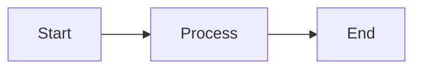

# Contributing to Documentation

Guide for maintaining and improving the Dementia Simulation documentation.

## Documentation Structure

We follow the [Diátaxis](https://diataxis.fr/) framework:

- **Tutorials**: Learning-oriented, step-by-step guides
- **How-to Guides**: Problem-oriented, practical solutions
- **Reference**: Information-oriented, technical descriptions
- **Explanation**: Understanding-oriented, background and context

## Building Locally

### Prerequisites

```bash
pip install mkdocs-material pymdown-extensions
```

### Build and Serve

```bash
# Build documentation
mkdocs build

# Serve locally with hot reload
mkdocs serve

# Visit http://127.0.0.1:8000
```

### Check for Issues

```bash
# Strict mode (fails on warnings)
mkdocs build --strict
```

## Writing Documentation

### Markdown Style

- Use ATX-style headers (`#`, `##`, `###`)
- Include code fences with language tags
- Add alt text to images
- Use admonitions for notes/tips/warnings

### Code Examples

Always include working code examples:

```python
# Good: Complete, runnable example
from dementia_simulation.persona import DementiaPersona

persona = DementiaPersona(stage="mild")
response = persona.generate_response("How are you?")
print(response)
```

### Diagrams

Use Mermaid for diagrams:



### Links

- Use relative links for internal pages: `[Guide](../tutorials/quickstart.md)`
- Use full URLs for external links: `[MkDocs](https://www.mkdocs.org/)`

## Adding New Pages

1. Create markdown file in appropriate section
2. Add to `nav` in `mkdocs.yml`
3. Test locally with `mkdocs serve`
4. Submit PR

## Updating API Documentation

### Current Approach

Module reference pages manually document key classes and functions.

### Future Enhancement: mkdocstrings

To enable auto-generated API docs:

1. **Install dependencies**:
   ```bash
   pip install 'mkdocstrings[python]'
   ```

2. **Update `mkdocs.yml`**:
   Uncomment the mkdocstrings plugin section

3. **Add to module pages**:
   ```markdown
   ::: dementia_simulation.persona
       options:
         show_source: true
         docstring_style: google
   ```

4. **Ensure docstrings**:
   All public APIs should have Google-style docstrings

### Docstring Style

Use Google-style docstrings:

```python
def example_function(param1: str, param2: int = 0) -> bool:
    """Short one-line summary.
    
    Longer description with more details about what this
    function does and how to use it.
    
    Args:
        param1: Description of param1
        param2: Description of param2. Defaults to 0.
    
    Returns:
        True if successful, False otherwise.
    
    Raises:
        ValueError: If param1 is empty.
        
    Example:
        >>> result = example_function("test", 42)
        >>> print(result)
        True
    """
    pass
```

## Deployment

### Automatic Deployment

Documentation automatically deploys to GitHub Pages when:
- Code is pushed to `main` branch
- Documentation files are modified
- Workflow is manually triggered

Workflow: `.github/workflows/docs.yml`

### Manual Deployment

```bash
# Deploy to GitHub Pages
mkdocs gh-deploy

# With message
mkdocs gh-deploy -m "Update documentation"
```

## Style Guide

### Writing Style

- **Be concise**: Get to the point quickly
- **Be specific**: Include exact commands, file paths, URLs
- **Be helpful**: Anticipate questions and confusion
- **Be consistent**: Follow existing patterns

### Voice and Tone

- **Active voice**: "Click the button" not "The button should be clicked"
- **Second person**: "You can configure..." not "One can configure..."
- **Present tense**: "The system validates..." not "The system will validate..."

### Formatting

- **Bold** for UI elements: "Click **Submit**"
- *Italic* for emphasis: "This is *important*"
- `code` for: commands, file names, code snippets
- > Blockquotes for: important notes or quotes

### Lists

- Use bullet points for unordered lists
- Use numbers for sequential steps
- Keep items parallel in structure

### Admonitions

```markdown
!!! note "Note Title"
    Content here

!!! tip "Helpful Tip"
    Pro tip here

!!! warning "Warning"
    Important warning

!!! danger "Danger"
    Critical information
```

## Review Checklist

Before submitting documentation changes:

- [ ] Spell check
- [ ] Links work (internal and external)
- [ ] Code examples run correctly
- [ ] Images have alt text
- [ ] Headers use proper hierarchy
- [ ] Page added to `nav` in `mkdocs.yml`
- [ ] Builds without errors: `mkdocs build --strict`
- [ ] Renders correctly: `mkdocs serve`
- [ ] Mobile responsive (check at different sizes)
- [ ] Cross-references are accurate

## Common Issues

### Build Failures

**Issue**: `ERROR - mkdocstrings: No module named 'dementia_simulation'`

**Solution**: Either:
1. Install package: `pip install -e .`
2. Or disable mkdocstrings temporarily

**Issue**: `WARNING - Doc file contains a link to '...', but target not found`

**Solution**: 
- Fix broken link
- Or exclude from docs if intentional

### Slow Builds

**Issue**: Build takes too long

**Solutions**:
- Reduce number of code examples
- Optimize large diagrams
- Check for infinite loops in nav
- Disable plugins temporarily for testing

## Resources

- [MkDocs Documentation](https://www.mkdocs.org/)
- [Material Theme](https://squidfunk.github.io/mkdocs-material/)
- [mkdocstrings](https://mkdocstrings.github.io/)
- [Mermaid Diagrams](https://mermaid.js.org/)
- [Diátaxis Framework](https://diataxis.fr/)
- [Google Style Python Docstrings](https://google.github.io/styleguide/pyguide.html#38-comments-and-docstrings)

## Questions?

- Open an issue on GitHub
- Check existing documentation issues
- Review this guide and linked resources
