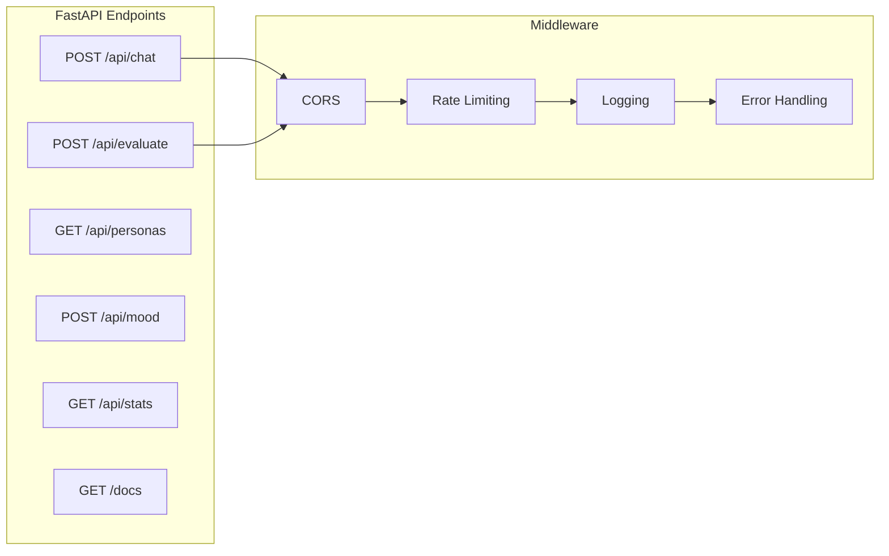
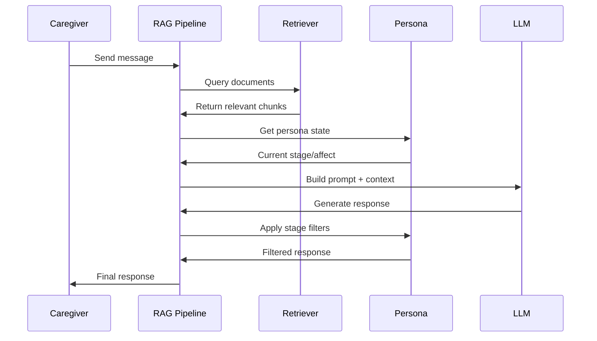
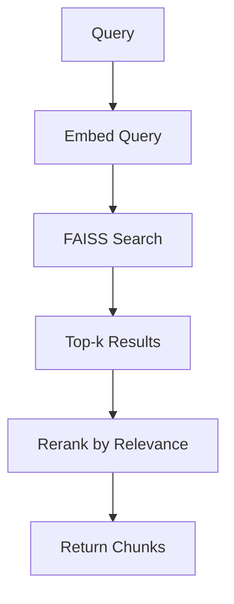
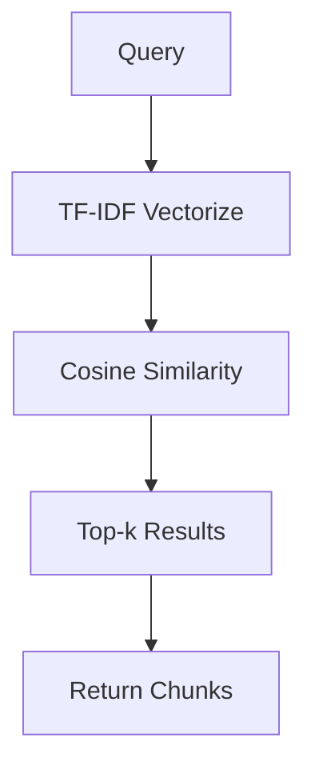
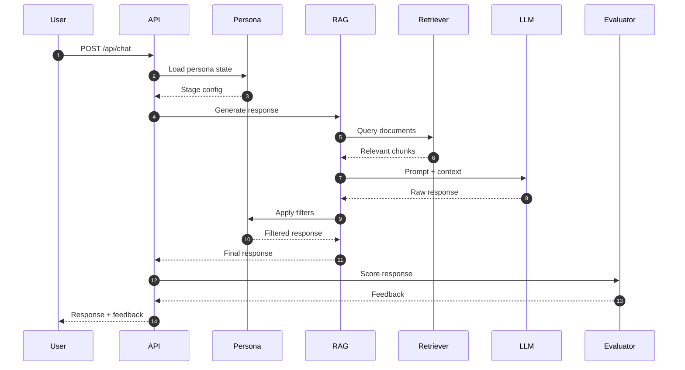
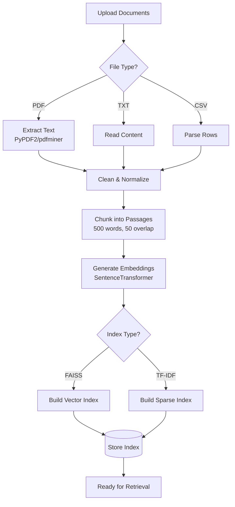
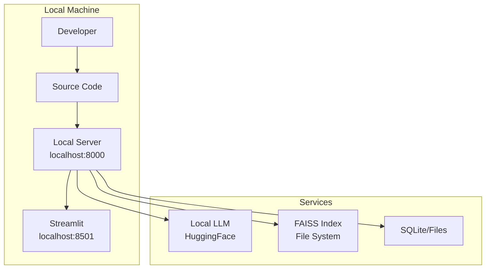
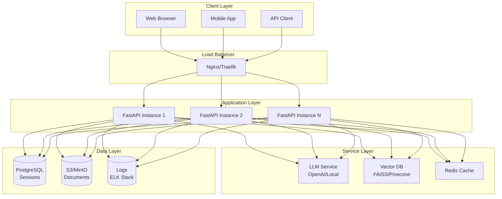
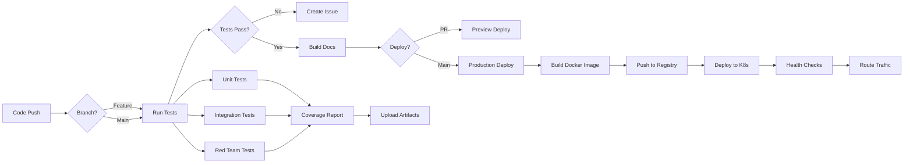

# Architecture

Comprehensive system architecture of the Dementia Simulation platform, including component interactions, data flow, and deployment structure.

## System Overview

The Dementia Simulation platform is a multi-layered application designed to provide realistic patient simulations for caregiver training.

### High-Level Architecture

```mermaid
graph TB
    subgraph "Frontend Layer"
        UI1[Streamlit Web UI]
        UI2[CLI Interface]
        UI3[External Apps]
    end
    
    subgraph "API Layer"
        API[FastAPI Server<br/>Port 8000]
        API1[/api/chat]
        API2[/api/evaluate]
        API3[/api/personas]
        API --> API1
        API --> API2
        API --> API3
    end
    
    subgraph "Core Services"
        PERSONA[Persona Manager<br/>Stage Simulation]
        RAG[RAG Pipeline<br/>Response Generation]
        EVAL[Evaluator<br/>Feedback Scoring]
    end
    
    subgraph "Knowledge Layer"
        RETRIEVER[Retriever<br/>Document Search]
        FAISS[(FAISS Index<br/>Vector DB)]
        KB[(Knowledge Base<br/>Documents)]
    end
    
    subgraph "Storage Layer"
        SESSIONS[(Session Store<br/>Conversations)]
        LOGS[(Logs<br/>Telemetry)]
        METRICS[(Metrics<br/>Evaluations)]
    end
    
    UI1 --> API
    UI2 --> API
    UI3 --> API
    
    API1 --> PERSONA
    API1 --> RAG
    API2 --> EVAL
    API3 --> PERSONA
    
    RAG --> RETRIEVER
    RAG --> PERSONA
    RETRIEVER --> FAISS
    RETRIEVER --> KB
    
    RAG --> SESSIONS
    EVAL --> LOGS
    EVAL --> METRICS
    
    style API fill:#4A90E2
    style RAG fill:#50C878
    style FAISS fill:#FFB347
    style EVAL fill:#E25D5D
```

## Component Details

### 1. Frontend Layer

Three interfaces provide access to the system:

#### Streamlit Web UI

- **Port**: 8501 (default)
- **Technology**: Streamlit
- **Features**:
    - Visual persona selection
    - Real-time chat
    - Feedback display
    - Session history
    - Mood tracking charts

#### CLI Interface

- **Command**: `dementia-sim chat`
- **Technology**: Click framework
- **Features**:
    - Interactive REPL
    - Persona selection menu
    - Turn-by-turn feedback
    - Session saving

#### External Applications

- **Protocol**: REST API
- **Auth**: Optional API key
- **Use cases**:
    - Mobile apps
    - Web integrations
    - Research tools

### 2. API Layer (FastAPI)

Central service handling all requests:



Key features:
- **OpenAPI docs** at `/docs` and `/redoc`
- **JSON schema** validation (Pydantic)
- **Async support** for concurrent requests
- **WebSocket** support (future)

### 3. Core Services

#### Persona Manager

Manages patient simulation state:

```python
class DementiaPersona:
    - stage: mild | moderate | severe
    - memory: short_term, long_term, confusion
    - communication: utterance_length, repetition
    - affect: mood, agitation_level
    - history: conversation_context
```

**Responsibilities**:
- Load stage configuration
- Apply stage parameters
- Track conversation history
- Simulate memory effects
- Manage affect state

#### RAG Pipeline

Generates contextually-informed responses:



**Pipeline stages**:
1. **Retrieval**: Find relevant documents
2. **Context**: Combine with persona state
3. **Generation**: LLM produces response
4. **Filtering**: Apply stage constraints
5. **Safety**: Check guardrails

#### Evaluator

Scores caregiver communication quality:

```python
class CaregiverFeedbackEvaluator:
    - detect_reassurance()
    - detect_confrontation()
    - calculate_scores()
    - generate_feedback()
```

**Scoring dimensions**:
- Reassurance (0.0 - 1.0)
- Confrontation (0.0 - 1.0)
- Overall (weighted combination)

### 4. Knowledge Layer

#### Retriever

Document search and ranking:

**FAISS Mode** (semantic search):


**Stub Mode** (keyword search):


#### FAISS Index

Vector database for semantic search:

- **Dimensions**: 384 (MiniLM) or 768 (MPNet)
- **Index type**: Flat, IVF, or HNSW
- **Metric**: Cosine similarity (normalized L2)

#### Knowledge Base

Document storage:

```
data/knowledge_base/
├── original/       # Source PDFs, TXT
├── processed/      # Cleaned, chunked
└── index/          # FAISS index files
```

### 5. Storage Layer

#### Session Store

Conversation persistence:

```json
{
  "session_id": "uuid",
  "persona_stage": "mild",
  "messages": [
    {"role": "caregiver", "content": "...", "timestamp": "..."},
    {"role": "patient", "content": "...", "timestamp": "..."}
  ],
  "evaluations": [...],
  "metadata": {...}
}
```

#### Logs

Structured logging with Loguru:

- **Application logs**: `logs/app.log`
- **Error logs**: `logs/error.log`
- **Access logs**: `logs/access.log`

#### Metrics

Performance and quality metrics:

- **Response times**: p50, p95, p99
- **Retrieval quality**: relevance scores
- **Evaluation scores**: distribution
- **Model performance**: tokens/sec

## Data Flow

### Chat Request Flow



### Document Processing Flow



## Deployment Architecture

### Development Environment



### Production Deployment



## CI/CD Pipeline



### CI Workflow (`.github/workflows/ci.yml`)

**Triggers**:
- Pull requests
- Pushes to `main`, `dev`, `feature/**`, `copilot/**`

**Jobs**:
1. **test-and-lint**:
    - Ruff format check
    - Ruff linting
    - MyPy type checking
    - Pytest unit tests
    - Upload quick metrics

2. **handle-failure**:
    - Create issue on failure
    - Tag `@github-copilot-workspace`

### Nightly Workflow (`.github/workflows/nightly.yml`)

**Triggers**:
- Scheduled: 2 AM UTC daily
- Manual dispatch

**Jobs**:
1. **faiss-regression**:
    - Build FAISS index
    - Run retrieval tests
    - Compare metrics vs. baseline
    - Alert on regression

## Technology Stack

### Backend
- **Python 3.10+**
- **FastAPI** - REST API framework
- **Pydantic** - Data validation
- **Uvicorn** - ASGI server

### ML/AI
- **Transformers** - LLM interface
- **Sentence-Transformers** - Embeddings
- **FAISS** - Vector search
- **PyTorch** - Deep learning backend

### Frontend
- **Streamlit** - Web UI
- **Click** - CLI framework

### Data
- **SQLite** - Local database
- **JSON** - Configuration files
- **Pickle** - Index persistence

### DevOps
- **GitHub Actions** - CI/CD
- **Poetry** - Dependency management
- **Pre-commit** - Code quality hooks
- **MkDocs** - Documentation

## Scalability Considerations

### Horizontal Scaling

Multiple API instances behind load balancer:

- **Stateless design**: No server-side sessions
- **Shared storage**: Common DB and vector index
- **Cache layer**: Redis for hot data

### Vertical Scaling

Single instance optimization:

- **GPU acceleration**: FAISS + PyTorch on GPU
- **Model quantization**: 8-bit inference
- **Batch processing**: Group requests
- **Async I/O**: Non-blocking operations

### Performance Targets

| Metric | Target | Current |
|--------|--------|---------|
| Response time (p95) | <2s | ~1.5s |
| Concurrent users | 100+ | Tested to 50 |
| Requests/sec | 50+ | ~30 |
| Index size | 1M docs | Tested to 100K |
| Uptime | 99.5% | - |

## Security Architecture

### API Security

- **Rate limiting**: 100 req/min per IP
- **API keys**: Optional authentication
- **CORS**: Configurable origins
- **Input validation**: Pydantic schemas

### Data Security

- **Encryption**: At rest (AES-256)
- **PII filtering**: Automatic redaction
- **Access logs**: All requests logged
- **Session isolation**: Per-user sandboxing

### Safety Guardrails

- **Content filtering**: Block harmful topics
- **Output validation**: Check generated text
- **Fallback responses**: Safe defaults
- **Red-team testing**: Adversarial evaluation

## Monitoring & Observability

### Metrics

Collected via Prometheus/custom:

- Request rate, latency, errors (RED metrics)
- Model inference time
- Retrieval quality scores
- Memory/CPU usage

### Logging

Structured logging with context:

```python
logger.info(
    "RAG response generated",
    extra={
        "session_id": session_id,
        "persona_stage": stage,
        "retrieval_docs": len(docs),
        "response_time": duration,
        "model": model_name
    }
)
```

### Alerting

Alert conditions:

- Error rate > 5%
- p95 latency > 3s
- Retrieval quality < 0.7
- Memory usage > 90%

## Next Steps

- **[Data Pipeline](data-pipeline.md)** - Document processing details
- **[Evaluation](evaluation-iteration.md)** - Testing and metrics
- **[Safety](safety-guardrails.md)** - Safety mechanisms
- **[API Reference](../reference/api/server.md)** - Endpoint documentation

## Related Resources

- [FastAPI Documentation](https://fastapi.tiangolo.com/)
- [FAISS Documentation](https://github.com/facebookresearch/faiss/wiki)
- [Streamlit Documentation](https://docs.streamlit.io/)
- [RAG Paper](https://arxiv.org/abs/2005.11401)
