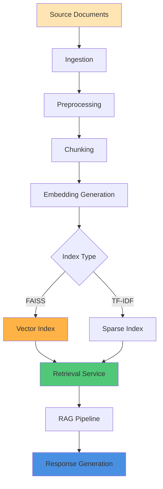
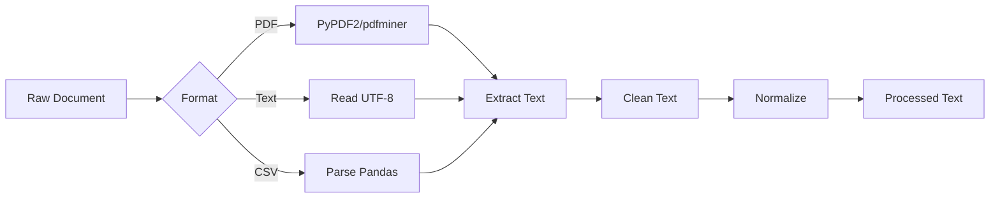
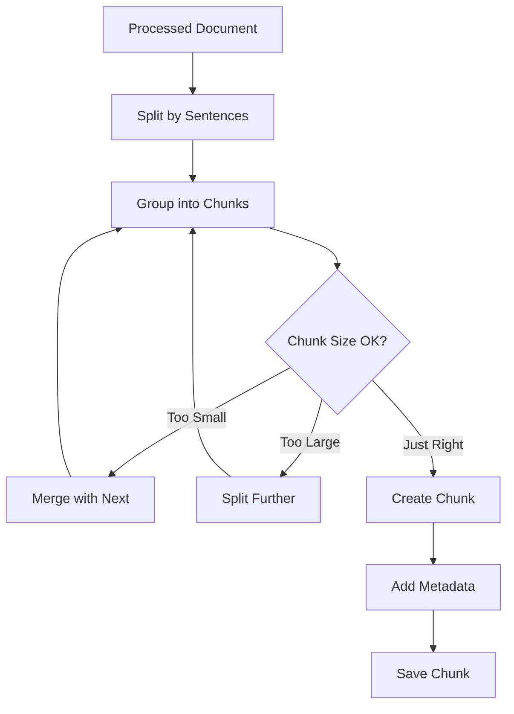
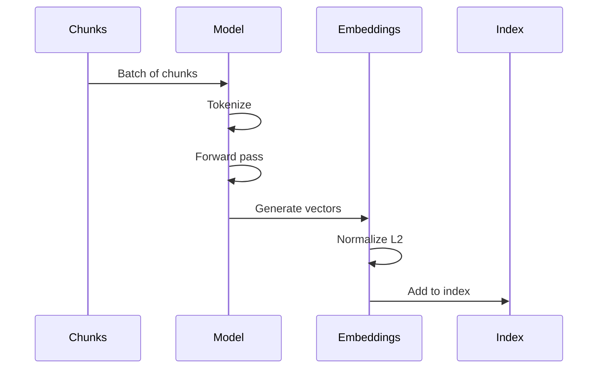
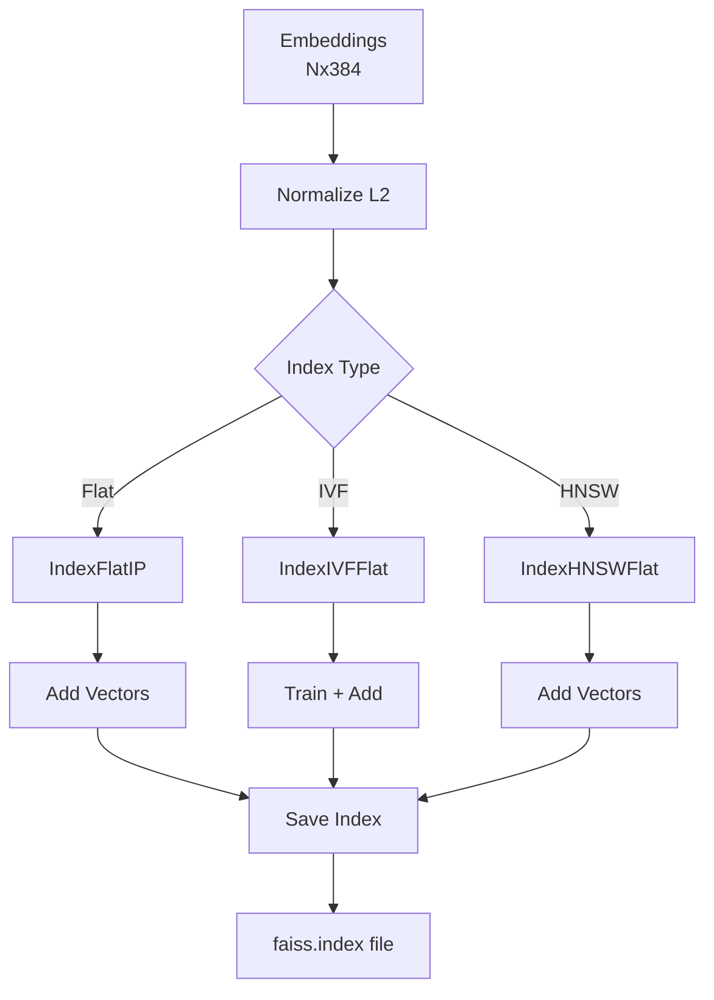
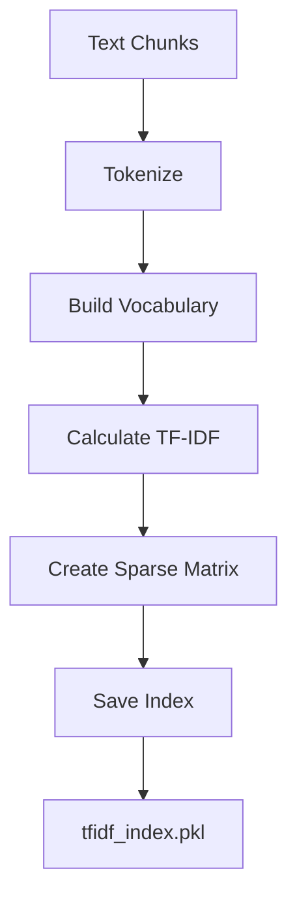
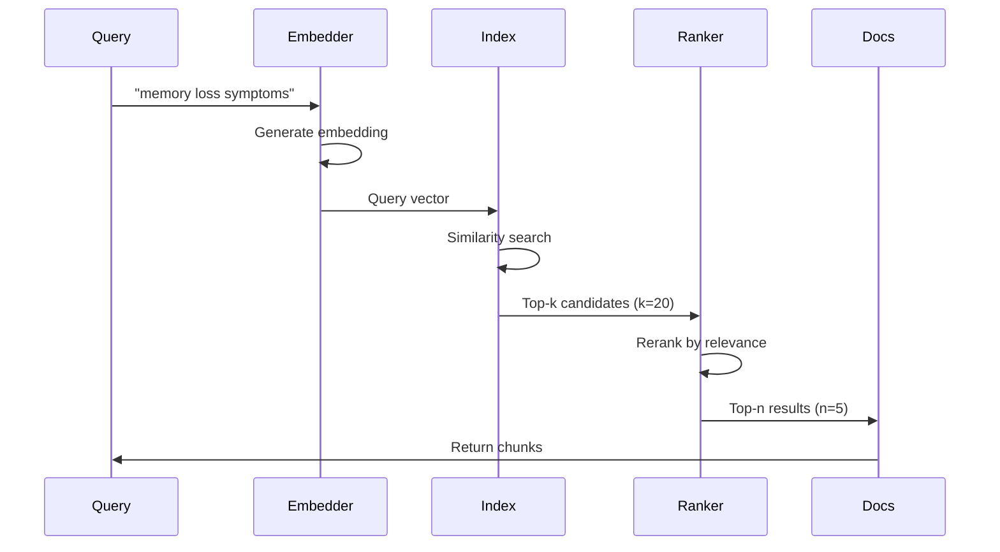
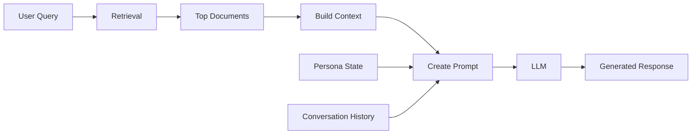

# Data Pipeline

Comprehensive explanation of how documents flow through the system: from source ingestion to retrieval-augmented generation.

## Pipeline Overview



## Stages

### 1. Source Ingestion

Documents are uploaded to `data/uploads/`:

```
data/uploads/
├── dementia_care_guide.pdf
├── communication_strategies.pdf
├── clinical_guidelines.txt
└── qa_pairs.csv
```

**Supported formats**:
- PDF (text-based)
- Plain text (`.txt`)
- CSV (structured data)
- Markdown (`.md`)

**Source manifest**: Optional `manifest.json` for metadata:

```json
{
  "files": [
    {
      "filename": "dementia_care_guide.pdf",
      "category": "clinical",
      "authority": "WHO",
      "date_published": "2024-01",
      "url": "https://example.com/guide.pdf"
    }
  ]
}
```

### 2. Preprocessing (`run_preprocessing.py`)

Extracts and cleans text from source documents:



**Operations**:

1. **Text extraction**:
   ```python
   # PDF
   with open(file_path, 'rb') as f:
       reader = PyPDF2.PdfReader(f)
       text = ''.join(page.extract_text() for page in reader.pages)
   
   # Text
   with open(file_path, 'r', encoding='utf-8') as f:
       text = f.read()
   ```

2. **Cleaning**:
   - Remove excessive whitespace
   - Fix encoding issues
   - Strip control characters
   - Normalize line breaks

3. **Structure extraction**:
   - Detect headings
   - Identify sections
   - Preserve paragraph breaks
   - Extract metadata

**Output**: `data/processed/` directory:

```
data/processed/
├── dementia_care_guide_processed.json
├── communication_strategies_processed.json
└── manifest.json
```

### 3. Chunking

Split documents into retrievable passages:



**Parameters** (default):

```python
CHUNK_SIZE = 500  # words
CHUNK_OVERLAP = 50  # words
MIN_CHUNK_SIZE = 100  # words
MAX_CHUNK_SIZE = 1000  # words
```

**Chunking strategy**:

- **Semantic**: Prefer natural boundaries (paragraphs, sections)
- **Overlap**: Include context from adjacent chunks
- **Size**: Balance context vs. precision

**Example chunk**:

```json
{
  "id": "dementia_care_guide_chunk_042",
  "text": "Memory loss is one of the most common early signs...",
  "source_file": "dementia_care_guide.pdf",
  "source_page": 12,
  "source_section": "Early Warning Signs",
  "char_count": 487,
  "word_count": 89,
  "chunk_index": 42,
  "metadata": {
    "category": "clinical",
    "authority": "WHO",
    "date_processed": "2024-01-15T10:30:00Z"
  }
}
```

### 4. Embedding Generation

Convert text chunks to vector embeddings:



**Model**: `all-MiniLM-L6-v2` (default)

```python
from sentence_transformers import SentenceTransformer

model = SentenceTransformer('all-MiniLM-L6-v2')
embeddings = model.encode(
    chunks,
    convert_to_numpy=True,
    show_progress_bar=True,
    batch_size=32
)
```

**Properties**:
- Dimensions: 384
- Range: [-1, 1] (after normalization)
- Metric: Cosine similarity

**Batch processing**:

```python
# Process in batches to avoid OOM
batch_size = 32
for i in range(0, len(chunks), batch_size):
    batch = chunks[i:i+batch_size]
    batch_embeddings = model.encode(batch)
    all_embeddings.append(batch_embeddings)

embeddings = np.vstack(all_embeddings)
```

### 5. Index Building

Create searchable index from embeddings:

#### FAISS Index (Semantic Search)



**Build process**:

```python
import faiss

# Create index
dimension = 384
index = faiss.IndexFlatIP(dimension)  # Inner product (cosine)

# Normalize embeddings
faiss.normalize_L2(embeddings)

# Add to index
index.add(embeddings.astype('float32'))

# Save
faiss.write_index(index, "data/index/faiss.index")
```

**Index files**:
- `faiss.index` - Binary index file
- `chunks.json` - Chunk metadata + text
- `model_name.txt` - Embedding model identifier

#### TF-IDF Index (Keyword Search)



**Build process**:

```python
from sklearn.feature_extraction.text import TfidfVectorizer
import pickle

# Create vectorizer
vectorizer = TfidfVectorizer(
    max_features=10000,
    min_df=2,
    max_df=0.8,
    ngram_range=(1, 2)
)

# Fit and transform
tfidf_matrix = vectorizer.fit_transform(chunks)

# Save
with open("data/index/tfidf_index.pkl", "wb") as f:
    pickle.dump({
        'vectorizer': vectorizer,
        'matrix': tfidf_matrix
    }, f)
```

### 6. Retrieval

Query the index for relevant documents:



**FAISS retrieval**:

```python
def search_faiss(query: str, k: int = 5):
    # Embed query
    query_embedding = model.encode([query])
    faiss.normalize_L2(query_embedding)
    
    # Search
    scores, indices = index.search(
        query_embedding.astype('float32'),
        k
    )
    
    # Get chunks
    results = []
    for score, idx in zip(scores[0], indices[0]):
        chunk = chunks[idx]
        results.append({
            'text': chunk['text'],
            'source': chunk['source_file'],
            'score': float(score),
            'metadata': chunk['metadata']
        })
    
    return results
```

**TF-IDF retrieval**:

```python
def search_tfidf(query: str, k: int = 5):
    # Vectorize query
    query_vec = vectorizer.transform([query])
    
    # Calculate similarity
    scores = (tfidf_matrix * query_vec.T).toarray().flatten()
    
    # Get top-k
    top_indices = scores.argsort()[-k:][::-1]
    
    # Build results
    results = []
    for idx in top_indices:
        chunk = chunks[idx]
        results.append({
            'text': chunk['text'],
            'source': chunk['source_file'],
            'score': float(scores[idx]),
            'metadata': chunk['metadata']
        })
    
    return results
```

### 7. RAG Integration

Use retrieved documents in response generation:



**Prompt construction**:

```python
def build_rag_prompt(
    query: str,
    persona_stage: str,
    retrieved_docs: List[Dict],
    conversation_history: List[Dict]
):
    # Context from retrieval
    context = "\n\n".join([
        f"[Source: {doc['source']}]\n{doc['text']}"
        for doc in retrieved_docs[:3]
    ])
    
    # Build prompt
    prompt = f"""
You are simulating a dementia patient at the {persona_stage} stage.

Relevant information from knowledge base:
{context}

Recent conversation:
{format_history(conversation_history)}

Caregiver: {query}
Patient:"""
    
    return prompt
```

## Pipeline Variants

### Full RAG Mode (FAISS Enabled)

**When**: `data/index/faiss.index` exists and `DISABLE_FAISS=0`

**Flow**:
1. Query → FAISS embedding
2. Semantic search → Top-k chunks
3. Rerank by relevance
4. Build context from top-n
5. Generate with LLM

**Advantages**:
- High-quality retrieval
- Semantic understanding
- Better long-tail queries

### Stub Mode (No FAISS)

**When**: `DISABLE_FAISS=1` or index not found

**Options**:

1. **TF-IDF fallback**:
   - Keyword-based search
   - Fast and lightweight
   - Good for exact terms

2. **Empty retrieval**:
   - No document context
   - Pure persona simulation
   - Fastest response

**Configuration**:

```bash
# In .env
DISABLE_FAISS=1
FALLBACK_MODE=tfidf  # or 'none'
```

## Performance Optimization

### Indexing Optimization

**Batch processing**:

```python
# Process large document sets in batches
for batch in batch_documents(all_docs, batch_size=1000):
    process_batch(batch)
    build_incremental_index(batch)
```

**Parallel processing**:

```python
from multiprocessing import Pool

with Pool(processes=4) as pool:
    results = pool.map(process_document, document_list)
```

**GPU acceleration**:

```python
# Use GPU for embedding generation
model = SentenceTransformer('all-MiniLM-L6-v2')
model = model.to('cuda')

embeddings = model.encode(chunks, device='cuda')
```

### Retrieval Optimization

**Query caching**:

```python
from functools import lru_cache

@lru_cache(maxsize=1000)
def cached_retrieval(query: str, k: int = 5):
    return search_documents(query, k)
```

**Pre-filtering**:

```python
def filtered_search(query: str, category: str = None):
    # Get more candidates
    results = search_documents(query, k=20)
    
    # Post-filter
    if category:
        results = [r for r in results if r['category'] == category]
    
    return results[:5]
```

**Index warming**:

```python
# Load index into memory on startup
index = faiss.read_index("data/index/faiss.index")
index = faiss.index_cpu_to_gpu(res, 0, index)  # Move to GPU
```

## Data Quality

### Validation

Check data quality at each stage:

```python
def validate_chunk(chunk: Dict) -> bool:
    checks = [
        len(chunk['text']) >= MIN_CHUNK_SIZE,
        len(chunk['text']) <= MAX_CHUNK_SIZE,
        chunk['source_file'] in valid_sources,
        'id' in chunk,
        'metadata' in chunk
    ]
    return all(checks)
```

### Monitoring

Track pipeline metrics:

```python
metrics = {
    'documents_processed': count_processed,
    'chunks_created': len(chunks),
    'avg_chunk_size': np.mean(chunk_sizes),
    'embedding_time': embedding_duration,
    'index_size_mb': index_size / 1024 / 1024,
    'retrieval_p95_latency': np.percentile(retrieval_times, 95)
}
```

### Testing

Validate retrieval quality:

```python
def test_retrieval_quality():
    test_queries = [
        ("memory loss symptoms", ["dementia_care_guide.pdf"]),
        ("communication strategies", ["communication_strategies.pdf"]),
        ("agitation management", ["behavioral_guidelines.pdf"])
    ]
    
    for query, expected_sources in test_queries:
        results = search_documents(query, k=5)
        actual_sources = [r['source'] for r in results]
        
        # Check if expected sources in top results
        assert any(src in actual_sources for src in expected_sources)
```

## Maintenance

### Incremental Updates

Add new documents without rebuilding:

```python
def incremental_update(new_docs: List[str]):
    # Process new documents
    new_chunks = preprocess_documents(new_docs)
    
    # Generate embeddings
    new_embeddings = model.encode(new_chunks)
    faiss.normalize_L2(new_embeddings)
    
    # Add to existing index
    index.add(new_embeddings)
    
    # Update metadata
    all_chunks.extend(new_chunks)
    save_chunks(all_chunks)
```

### Index Rebuilding

Periodic full rebuilds for optimization:

```bash
# Full rebuild script
#!/bin/bash
# Backup current index
cp -r data/index data/index.backup

# Clear and rebuild
rm -rf data/processed data/index
python run_preprocessing.py
python build_index.py

# Validate
python scripts/validate_index.py
```

### Cleanup

Remove outdated or low-quality documents:

```python
def cleanup_index(min_score: float = 0.3):
    # Test retrieval quality
    low_quality_docs = []
    
    for doc_id in all_document_ids:
        avg_score = test_document_retrieval(doc_id)
        if avg_score < min_score:
            low_quality_docs.append(doc_id)
    
    # Remove from index
    remove_documents(low_quality_docs)
    rebuild_index()
```

## Troubleshooting

### Common Issues

**Empty retrieval results**:
- Check index exists
- Verify query encoding
- Try broader queries

**Poor retrieval quality**:
- Use better embedding model
- Increase chunk overlap
- Add more documents
- Try semantic search (FAISS)

**Slow indexing**:
- Use batch processing
- Enable GPU acceleration
- Reduce chunk overlap
- Use parallel processing

**High memory usage**:
- Process in batches
- Use smaller embedding model
- Enable index compression
- Clear intermediate files

## Next Steps

- **[Architecture](architecture.md)** - Overall system design
- **[Build Index Tutorial](../tutorials/build-index.md)** - Hands-on guide
- **[Enable FAISS](../how-to/enable-faiss.md)** - Setup semantic search
- **[Retriever API](../reference/modules/retriever.md)** - Module documentation

## Related Resources

- [FAISS Documentation](https://github.com/facebookresearch/faiss/wiki)
- [Sentence Transformers](https://www.sbert.net/)
- [TF-IDF Explanation](https://en.wikipedia.org/wiki/Tf%E2%80%93idf)
- [RAG Paper](https://arxiv.org/abs/2005.11401)
