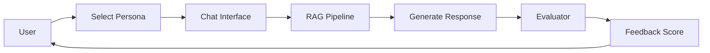
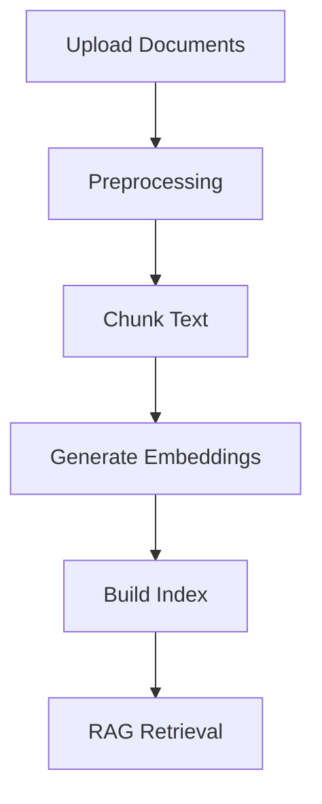

# Explanation

Understanding-oriented documentation that explains the concepts, design decisions, and architecture of the Dementia Simulation platform.

## 📐 Architecture & Design

### [Architecture Overview](architecture.md)

Comprehensive system design showing how all components work together.

**Topics covered**:
- High-level system architecture
- Component interactions
- Data flow diagrams
- Technology stack
- Deployment architecture
- CI/CD pipeline

---

### [Data Pipeline](data-pipeline.md)

How documents are processed, indexed, and retrieved for RAG.

**Topics covered**:
- Document ingestion workflow
- Preprocessing and normalization
- Embedding generation
- FAISS indexing
- Retrieval mechanisms
- Stub mode vs. full RAG

---

### [Evaluation & Iteration](evaluation-iteration.md)

Testing, measurement, and continuous improvement workflows.

**Topics covered**:
- Per-PR quick metrics
- Unit and integration tests
- API smoke tests
- Nightly FAISS regression
- Logging and telemetry
- Reading artifacts
- Improvement cycles

---

### [Safety Guardrails](safety-guardrails.md)

Safety mechanisms protecting against harmful interactions.

**Topics covered**:
- Content filtering rules
- Blocked topics (medical advice, coercion)
- Red-team test suite
- Fallback behaviors
- Safety monitoring
- Incident response

---

### [Personas](personas.md)

Patient simulation model with stage-based parameters.

**Topics covered**:
- Dementia stages (mild, moderate, severe)
- Stage parameters
- Memory modeling
- Communication patterns
- Behavioral simulation
- Affect transitions
- Configuration system

---

## 🧠 Core Concepts

### Retrieval-Augmented Generation (RAG)

The system uses RAG to ground responses in knowledge base documents:

1. **Retrieve** relevant documents for context
2. **Augment** the prompt with retrieved information
3. **Generate** a contextually-informed response

### Persona Simulation

Patient personas model realistic dementia behaviors:

- **Stage-based** parameters (mild → moderate → severe)
- **Memory** simulation (short-term, long-term, confusion)
- **Communication** patterns (utterance length, repetition)
- **Affect** modeling (mood, agitation, anxiety)

### Empathy Evaluation

Caregiver responses are scored on:

- **Reassurance** language (validation, comfort)
- **Confrontation** avoidance (no corrections, arguments)
- **Overall quality** (combined metrics)

## 🔄 System Workflows

### Training Workflow

### Document Processing Workflow

## 📊 Design Principles

### 1. Privacy First

- Local model execution possible
- No required external API calls
- Session data encrypted
- No PHI in logs

### 2. Evidence-Based

- Responses grounded in documents
- Citations for transparency
- Medical advice blocked
- Safety guardrails active

### 3. Realistic Simulation

- Stage-accurate behaviors
- Natural conversation flow
- Memory consistency
- Affect modeling

### 4. Continuous Improvement

- Automated testing
- Metrics tracking
- Red-team safety tests
- Performance monitoring

## 🏗️ Technology Choices

### Why FastAPI?

- Modern async Python framework
- Auto-generated API docs
- Type safety with Pydantic
- Easy deployment

### Why FAISS?

- Fast semantic search
- Scales to millions of docs
- GPU acceleration available
- Industry standard

### Why Streamlit?

- Rapid UI development
- Python-native
- Built-in components
- Easy deployment

### Why Transformers?

- State-of-the-art models
- HuggingFace ecosystem
- Local execution
- Fine-tuning capable

## 📚 Further Reading

- [Diátaxis Framework](https://diataxis.fr/) - Documentation philosophy
- [RAG Paper](https://arxiv.org/abs/2005.11401) - Original RAG research
- [FAISS](https://github.com/facebookresearch/faiss) - Vector search library
- [Dementia Care Guidelines](https://www.alz.org/professionals/professional-providers/dementia_care_practice_recommendations) - Clinical background

## Need Help Understanding?

- 💬 [GitHub Discussions](https://github.com/iloveangpao/dementia_simulation/discussions)
- 📖 [Tutorials](../tutorials/index.md) - Hands-on learning
- 📋 [How-to Guides](../how-to/index.md) - Specific tasks
- 📚 [API Reference](../reference/index.md) - Technical details
