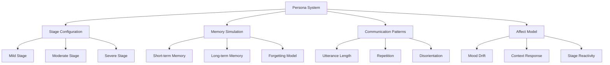
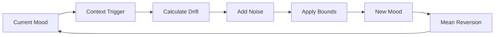

# Personas

Detailed explanation of the patient persona simulation system, including stage-based parameters, affect modeling, and behavioral simulation.

## Overview

The persona system simulates realistic dementia patient behaviors across three stages: **mild**, **moderate**, and **severe**. Each stage has carefully calibrated parameters for memory, communication, and behavioral patterns.



## Dementia Stages

### Mild Stage

**Characteristics**:
- Early cognitive changes
- Mostly independent
- Aware of difficulties
- Can compensate for deficits

**Common behaviors**:
- Occasional memory lapses
- Mild confusion about recent events
- Some repetition
- Generally appropriate social interaction

### Moderate Stage

**Characteristics**:
- Noticeable cognitive decline
- Requires assistance
- Less aware of deficits
- Communication difficulties increase

**Common behaviors**:
- Frequent memory problems
- Confusion about time/place
- Increased repetition
- Mood changes more common

### Severe Stage

**Characteristics**:
- Significant cognitive impairment
- Requires full-time care
- Limited awareness
- Severe communication difficulties

**Common behaviors**:
- Profound memory loss
- Constant confusion
- Very repetitive
- Emotional lability

## Stage Parameters

### Memory Parameters

Parameters controlling memory simulation:

| Parameter | Mild | Moderate | Severe | Description |
|-----------|------|----------|--------|-------------|
| **Short-term retention** | 30 min | 10 min | 2 min | How long new info is remembered |
| **Long-term clarity** | 85% | 60% | 25% | Clarity of old memories |
| **Confusion likelihood** | 0.2 | 0.5 | 0.8 | Probability of confusion |
| **Repetition tendency** | 0.1 | 0.3 | 0.6 | Probability of repetitive behavior |
| **Forgetting window** | 24h | 8h | 2h | Time window for forgetting |

**Implementation**:

```python
class MemoryModel:
    def __init__(self, stage_config):
        self.retention_time = stage_config['short_term_retention_minutes']
        self.clarity = stage_config['long_term_clarity_percent']
    
    def remember(self, info: str, timestamp: datetime) -> bool:
        """Check if info is still remembered"""
        elapsed = (datetime.now() - timestamp).total_seconds() / 60
        
        if elapsed > self.retention_time:
            # Apply forgetting curve
            prob_remember = math.exp(-elapsed / self.retention_time)
            return random.random() < prob_remember
        
        return True
    
    def recall_clarity(self, memory: str) -> str:
        """Apply clarity degradation to long-term memories"""
        if random.random() > self.clarity / 100:
            # Memory is unclear
            return self._add_confusion(memory)
        return memory
```

### Communication Parameters

Parameters controlling speech and language:

| Parameter | Mild | Moderate | Severe | Description |
|-----------|------|----------|--------|-------------|
| **Utterance length mean** | 100 | 70 | 40 | Average response length (chars) |
| **Utterance length std** | 30 | 25 | 15 | Standard deviation |
| **Utterance length max** | 250 | 180 | 100 | Soft maximum (80% enforced) |
| **Allow short bursts** | No | No | Yes | Enable very short responses |

**Distribution-based sampling**:

```python
def sample_utterance_length(self) -> int:
    """Sample response length from truncated normal distribution"""
    mean = self.config['utterance_length_mean']
    std = self.config['utterance_length_std']
    max_len = self.config['utterance_length_max']
    
    # Truncated normal distribution
    length = np.random.normal(mean, std)
    
    # Soft maximum (80% enforcement)
    if length > max_len:
        if random.random() < 0.8:
            length = max_len
    
    # Short bursts for severe stage
    if self.stage == "severe" and random.random() < 0.3:
        length = random.randint(5, 20)
    
    return int(max(10, length))
```

**Natural variation**:

- Uses truncated normal distribution
- Adds random jitter to avoid robotic patterns
- Simulates cognitive variability

### Disorientation Parameters

Parameters controlling confusion about time, place, and people:

| Parameter | Mild | Moderate | Severe | Description |
|-----------|------|----------|--------|-------------|
| **Time disorientation** | 0.1 | 0.4 | 0.8 | Confusion about time |
| **Person disorientation** | 0.05 | 0.3 | 0.7 | Not recognizing people |
| **Place disorientation** | 0.05 | 0.3 | 0.7 | Confusion about location |

**Usage**:

```python
def apply_disorientation(self, response: str) -> str:
    """Add disorientation to response if triggered"""
    
    if self.check_time_disorientation():
        response += " What day is it today?"
    
    if self.check_person_disorientation():
        response = "I'm not sure if we've met before... " + response
    
    if self.check_place_disorientation():
        response += " Where are we exactly?"
    
    return response
```

### Behavioral Parameters

Parameters controlling mood and cooperation:

| Parameter | Mild | Moderate | Severe | Description |
|-----------|------|----------|--------|-------------|
| **Agitation baseline** | 0.1 | 0.3 | 0.5 | Base agitation probability |
| **Mood volatility** | 0.2 | 0.4 | 0.6 | How quickly mood changes |
| **Cooperation level** | 0.8 | 0.6 | 0.4 | Willingness to cooperate |

## Affect Model

### Bounded Random Walk

The affect system uses an Ornstein-Uhlenbeck process for realistic mood simulation:



**Key features**:

- **Mean reversion**: Naturally drifts back to baseline
- **Context-conditioned**: Responds to caregiver communication
- **Stage-dependent**: Severe stages react more strongly
- **Bounded**: Stays within realistic range [-2, 2]
- **Stochastic**: Natural variability through noise

### Mood Drift System

**Negative drift** (calming triggers):

| Trigger | Drift | Description |
|---------|-------|-------------|
| Validation | -1.2 | Acknowledging feelings |
| Reassurance | -1.0 | Providing comfort |
| Agreement | -0.8 | Agreeing with patient |
| Empathy | -0.7 | Showing understanding |
| Routine | -0.5 | Familiar activities |

**Positive drift** (agitating triggers):

| Trigger | Drift | Description |
|---------|-------|-------------|
| Contradiction | +1.5 | Correcting patient |
| Rushing | +1.2 | Hurrying the patient |
| Arguing | +1.0 | Disagreeing or debating |
| Complexity | +0.8 | Too many options |
| Noise | +0.6 | Loud environment |

**Implementation**:

```python
class AffectModel:
    def __init__(self, stage_config):
        self.mood = 0.0  # Neutral
        self.baseline = 0.0
        self.volatility = stage_config['mood_volatility']
        self.agitation_baseline = stage_config['agitation_baseline']
    
    def update_mood(self, trigger: str, delta_time: float):
        """Update mood using Ornstein-Uhlenbeck process"""
        
        # Get drift from trigger
        drift = MOOD_DRIFT_MAP.get(trigger, 0.0)
        
        # Scale by stage reactivity
        drift *= self.volatility
        
        # Mean reversion term
        reversion = -0.3 * (self.mood - self.baseline)
        
        # Stochastic noise
        noise = np.random.normal(0, 0.1)
        
        # Update mood
        self.mood += (drift + reversion) * delta_time + noise
        
        # Apply bounds
        self.mood = np.clip(self.mood, -2.0, 2.0)
    
    def get_mood_label(self) -> str:
        """Convert mood value to label"""
        if self.mood > 1.0:
            return "agitated"
        elif self.mood > 0.3:
            return "anxious"
        elif self.mood < -1.0:
            return "calm"
        elif self.mood < -0.3:
            return "content"
        else:
            return "neutral"
```

### Context Detection

Automatic detection of caregiver communication patterns:

```python
VALIDATION_PATTERNS = [
    r"i understand",
    r"that must be",
    r"i can see",
    r"sounds like",
    r"makes sense"
]

CONTRADICTION_PATTERNS = [
    r"no, that's not",
    r"actually,",
    r"you're wrong",
    r"that didn't happen",
    r"you're confused"
]

def detect_context(caregiver_message: str) -> List[str]:
    """Detect communication context from message"""
    triggers = []
    msg_lower = caregiver_message.lower()
    
    for pattern in VALIDATION_PATTERNS:
        if re.search(pattern, msg_lower):
            triggers.append('validation')
            break
    
    for pattern in CONTRADICTION_PATTERNS:
        if re.search(pattern, msg_lower):
            triggers.append('contradiction')
            break
    
    return triggers
```

## Conversation History

Personas track conversation context:

```python
class ConversationHistory:
    def __init__(self, max_turns: int = 10):
        self.messages = []
        self.max_turns = max_turns
    
    def add_message(self, role: str, content: str):
        """Add message to history"""
        self.messages.append({
            'role': role,
            'content': content,
            'timestamp': datetime.now()
        })
        
        # Keep only recent turns
        if len(self.messages) > self.max_turns * 2:
            self.messages = self.messages[-self.max_turns*2:]
    
    def get_context(self, n_turns: int = 5) -> str:
        """Get recent conversation context"""
        recent = self.messages[-n_turns*2:]
        return "\n".join([
            f"{msg['role']}: {msg['content']}"
            for msg in recent
        ])
```

## Persona API

### Creating a Persona

```python
from dementia_simulation.persona import DementiaPersona, DementiaStage

# Create persona
persona = DementiaPersona(
    name="Mary",
    age=78,
    stage=DementiaStage.MODERATE
)

# Or from string
persona = DementiaPersona.from_stage_str("moderate")
```

### Generating Responses

```python
# Generate response
response = persona.generate_response(
    caregiver_message="How are you feeling today?",
    context=conversation_history
)

# Response includes:
# - text: The generated response
# - mood: Current mood state
# - triggers: Detected context triggers
# - metadata: Stage parameters used
```

### Checking State

```python
# Check memory
if persona.remembers("breakfast"):
    print("Remembers eating breakfast")

# Check mood
mood = persona.get_mood()
print(f"Current mood: {mood}")

# Check disorientation
if persona.is_disoriented('time'):
    print("Patient is disoriented about time")
```

## Configuration File

Stage parameters are defined in `src/dementia_simulation/persona/stage_config.yaml`:

```yaml
mild:
  memory:
    short_term_retention_minutes: 30
    long_term_clarity_percent: 85
    confusion_likelihood: 0.2
    repetition_tendency: 0.1
    forgetting_window_hours: 24
  
  communication:
    utterance_length_mean: 100
    utterance_length_std: 30
    utterance_length_max: 250
    allow_short_bursts: false
  
  disorientation:
    time_disorientation_likelihood: 0.1
    person_disorientation_likelihood: 0.05
    place_disorientation_likelihood: 0.05
  
  behavioral:
    agitation_baseline: 0.1
    mood_volatility: 0.2
    cooperation_level: 0.8

# moderate and severe stages follow...
```

## Best Practices

### ✅ Do

- Use appropriate stage for training scenario
- Pay attention to mood indicators
- Respond to context triggers
- Practice validation techniques
- Avoid contradictions

### ❌ Don't

- Correct patient's confusion
- Rush interactions
- Use complex language
- Argue or debate
- Overwhelm with choices

## Next Steps

- **[Architecture](architecture.md)** - System overview
- **[Safety Guardrails](safety-guardrails.md)** - Safety mechanisms
- **[Persona API](../reference/modules/persona.md)** - Module documentation
- **[Quickstart Tutorial](../tutorials/quickstart.md)** - Get started

## Related Resources

- [Dementia Care Guidelines](https://www.alz.org/professionals/professional-providers/dementia_care_practice_recommendations)
- [Person-Centered Care](https://www.ncbi.nlm.nih.gov/pmc/articles/PMC4608608/)
- [Validation Therapy](https://www.vfvalidation.org/)
- [PERSONA_STAGE_AFFECT_SAFETY.md](../PERSONA_STAGE_AFFECT_SAFETY.md) - Full technical documentation
